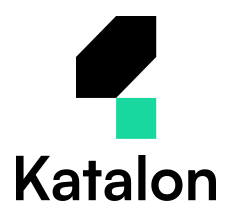
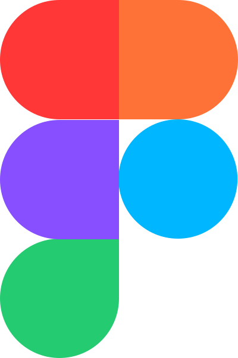

# Hi, I'm Fahmi 

  

Welcome to my CodePark 🌳

 

  
  

 

# My Skill Set 

## Language

## Frontend

<a title="Next.js" href="https://github.com/mfahmialkautsar?tab=repositories&q=topic%3Anextjs">
  <picture>
    <source
      srcset="./assets/images/icons/nextjs-dark.svg"
      media="(prefers-color-scheme: dark)"
    />
    <source
      srcset="./assets/images/icons/nextjs.svg"
      media="(prefers-color-scheme: light), (prefers-color-scheme: no-preference)"
    />
    
  </picture>
</a>

<a title="Shadcn" href="https://github.com/mfahmialkautsar?tab=repositories&q=topic%3Ashadcn">
  <picture>
    <source media="(prefers-color-scheme: dark)" srcset="./assets/images/icons/shadcn-dark.svg">
    
  </picture>
</a>

## Backend

<a title="Express" href="https://github.com/mfahmialkautsar?tab=repositories&q=topic%3Aexpress">
  <picture>
    <source
      srcset="./assets/images/icons/express-dark.png"
      media="(prefers-color-scheme: dark)"
    />
    
  </picture>
</a>
<a title="Node.js" href="https://github.com/mfahmialkautsar?tab=repositories&q=topic%3Anode">
  <picture>
    <source
      srcset="./assets/images/icons/nodejs-dark.svg"
      media="(prefers-color-scheme: dark)"
    />
    
  </picture>
</a>

## Database

## DevOps

## Cloud

## Testing

## Message Queue

## API Protocol

| <strong>REST</strong> |  | <strong>WebSocket</strong> |
| --------------------- | ---------------------------------------------------------------------------------------------------------------------------------------------------------------------------- | -------------------------- |

## ML/AI

## Others

---

<picture>
  <source media="(prefers-color-scheme: dark)" srcset="https://raw.githubusercontent.com/mfahmialkautsar/mfahmialkautsar/output/github-contribution-grid-snake-dark.svg">
  
</picture>
